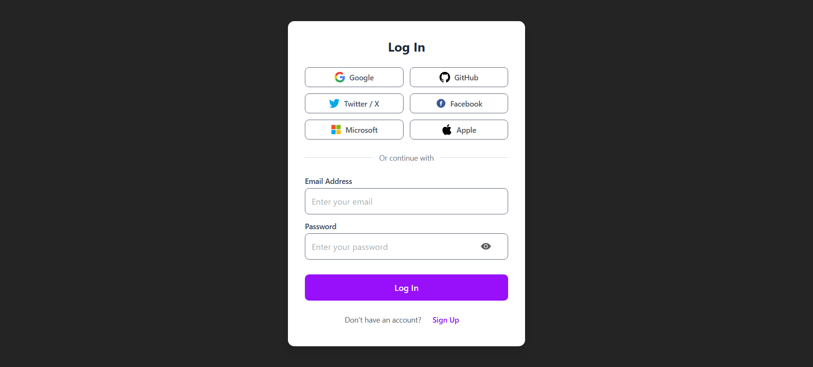
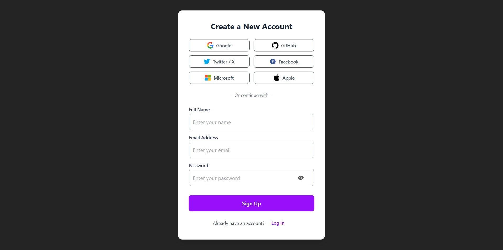

# 🔐 Multi-Auth App

**A clean and modern multi-provider authentication app built with React & Firebase.**

> This project demonstrates how to implement authentication in a React application using **Firebase Authentication** with multiple OAuth providers. Users can securely log in with their Google, GitHub, Microsoft, Facebook, Twitter, Apple, or Email accounts, view their profile details, and log out. A perfect starter project for learning multi-authentication in React.

---

## 📖 Project Description

This project provides a complete authentication flow using **Firebase + React**:

* Login using multiple providers (**Google, GitHub, Microsoft, Facebook, Twitter, Apple, Email/Password**).
* Retrieve and display user profile information (name, email, avatar).
* Provide logout functionality that clears the session.
* Show success and error messages with **Toast notifications**.

---

## ✅ Features

* 🔐 Multi-provider login (Google, GitHub, Microsoft, Facebook, Twitter, Apple, Email/Password)
* 👤 Display logged-in user's profile picture, name, and email
* 🚪 Logout and clear session
* 🔔 Toast notifications for login success/error
* 🧼 Clean and minimal UI using TailwindCSS
* 🔄 Auto-detect logged-in user session on reload

---

## 🧠 React Concepts Used

| Concept                  | Usage                                           |
| ------------------------ | ----------------------------------------------- |
| `useState`               | Manage user session and authentication state    |
| `useEffect`              | Persist user state and handle side effects      |
| `conditional rendering`  | Toggle UI based on login state                  |
| `context API` (optional) | Manage authentication state globally            |
| `3rd-party integration`  | Firebase Authentication with multiple providers |

---

## 🧰 Tools & Libraries

| Tool                        | Purpose                                 |
| --------------------------- | --------------------------------------- |
| **React**                   | Build components and manage state       |
| **Firebase Authentication** | Handle multiple auth providers securely |
| **TailwindCSS**             | Modern and clean UI styling             |
| **React Hot Toast**         | Notifications for login/logout events   |
| **Vite**                    | Frontend build tooling                  |
| **gh-pages**                | Deploy project to GitHub Pages          |

---

## 📸 Screenshots

### 🔐 Login View

### 📝 Sign Up View

### 👤 User Profile View

---

## 🧑‍💻 Author

**Maher Elmair**

* 📫 [maher.elmair.dev@gmail.com](mailto:maher.elmair.dev@gmail.com)
* 🔗 [LinkedIn](https://www.linkedin.com/in/maher-elmair)
* ✖️ [X (Twitter)](https://x.com/Maher_Elmair)
* ❤️ Made with passion by [Maher Elmair](https://maher-elmair.github.io/My_Website)

---

## 🔗 Live Preview

🚀 **Try it live on GitHub Pages:**

🌍 [Live Link](https://maher-elmair.github.io/Login-multi-auth/)

---

## 🙌 Thank You

If you find this project helpful, feel free to ⭐ the repository!
Suggestions, issues, and contributions are always welcome 🙏

---